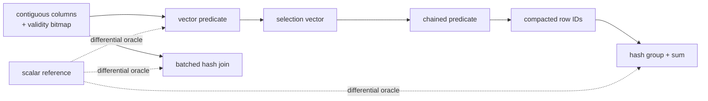

# columnar-engine

A dependency-free C++17 vector-at-a-time analytical query engine.

[](https://github.com/asp53826/columnar-engine/actions/workflows/ci.yml)


> The useful benchmark is not where vectorization wins. It is where the
> crossover happens—and why.

## Execution core

- typed contiguous columns with explicit null bitmaps;
- composable, order-preserving selection vectors;
- SQL-style predicate semantics where `NULL` never selects a row;
- batched numeric predicates and fused multi-predicate execution;
- null-aware hash aggregation and duplicate-preserving inner hash joins;
- a deliberately separate tuple-at-a-time reference executor;
- batch sizes from one row upward with bounds-checked selections.



## Evidence

On an Apple M2 Pro with Apple Clang 17:

| Verification | Result |
|---|---:|
| Correctness assertions | **5,880 passed** |
| Random filter/aggregate trials | 120 |
| Random join trials | 100 |
| Predicate variants per filter trial | 6 |
| Batch sizes per filter trial | 1, 7, 64, 1,024 |
| Scalar/vector disagreements | **0** |

The differential suite covers empty tables, null placement, chained
selections, all six comparisons, duplicate join keys, invalid row IDs, and
aggregate null handling.

## Measured crossover

The benchmark chains two filters and a grouped sum. Lower selectivity means
fewer rows survive.

| Rows | Surviving | Scalar | Vector | Speedup |
|---:|---:|---:|---:|---:|
| 1,000 | 6.7% | 3.93 µs | 4.65 µs | **0.85×** |
| 10,000 | 36.8% | 101.83 µs | 64.09 µs | **1.59×** |
| 100,000 | 36.9% | 1,307.50 µs | 772.79 µs | **1.69×** |
| 1,000,000 | 7.4% | 4,919.08 µs | 3,786.18 µs | **1.30×** |
| 1,000,000 | 66.8% | 16,210.60 µs | 9,388.83 µs | **1.73×** |

At 1,000 rows the selection mask and compaction pass cost more than they save.
At 10,000+ rows with moderate survival, contiguous batched work amortizes that
cost. Highly selective scans cross over later. Both sides are reported.

## Run it

```bash
make test
make benchmark
```

## Honest boundary

This is an execution-kernel project, not a SQL database. It does not yet have a
parser, optimizer, persistence layer, string operators, parallel scheduling,
or spill-to-disk aggregation. Its job is to make vector-at-a-time semantics and
their performance tradeoffs independently testable without hiding behind an
existing query framework.
