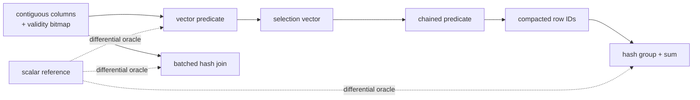

# columnar-engine

A dependency-free C++17 vector-at-a-time analytical query engine.

[](https://github.com/asp53826/columnar-engine/actions/workflows/ci.yml)


> The useful benchmark is not where vectorization wins. It is where the
> crossover happens—and why.

## Execution core

- typed contiguous columns with explicit null bitmaps;
- composable, order-preserving selection vectors;
- SQL-style predicate semantics where `NULL` never selects a row;
- batched numeric predicates and fused multi-predicate execution;
- null-aware hash aggregation and duplicate-preserving inner hash joins;
- a deliberately separate tuple-at-a-time reference executor;
- batch sizes from one row upward with bounds-checked selections.



## Evidence

On an Apple M2 Pro with Apple Clang 17:

| Verification | Result |
|---|---:|
| Correctness assertions | **6,288 passed** |
| Random filter/aggregate trials | 120 |
| Random join trials | 100 |
| Random TPC-H Q1 trials | 100 × four batch sizes |
| Predicate variants per filter trial | 6 |
| Batch sizes per filter trial | 1, 7, 64, 1,024 |
| Scalar/vector disagreements | **0** |

The differential suite covers empty tables, null placement, chained
selections, all six comparisons, duplicate join keys, invalid row IDs,
aggregate null handling, unequal schemas, and complete TPC-H Q1 measure
agreement.

## A real analytical operator: TPC-H Q1

The first version only benchmarked a filter followed by `GROUP BY`. That proved
the primitives, but not that they compose into a nontrivial query. The engine
now implements the computational core of TPC-H Query 1 over seven columns:

```sql
SELECT returnflag, linestatus,
       SUM(quantity),
       SUM(extendedprice),
       SUM(extendedprice * (1 - discount)),
       SUM(extendedprice * (1 - discount) * (1 + tax)),
       AVG(quantity), AVG(extendedprice), AVG(discount), COUNT(*)
FROM lineitem
WHERE shipdate <= ?
GROUP BY returnflag, linestatus;
```

The vector executor creates one validity/predicate mask per batch, then updates
all six aggregate states in a fused pass. It does not materialize an
intermediate table or repeatedly evaluate `extendedprice * (1-discount)`.
The scalar version is separately written and shares only the tiny arithmetic
update helper; row qualification and execution control are independent.

At one million rows, the median of five runs:

| executor | time | rows/s |
|---|---:|---:|
| tuple-at-a-time | 23.51 ms | 42.5M |
| vector-at-a-time, 1,024 rows/batch | **18.85 ms** | **53.1M** |

That is **1.25×**, smaller than the synthetic filter pipeline's best result.
Q1 does substantial arithmetic and hash-table work per surviving row, so scan
dispatch is a smaller fraction of total time. This is the expected result, not
a disappointing one.

## How the operators work

### Validity bitmaps

Nullness is stored separately from values: one bit per row, packed into
64-bit words. Value arrays remain dense and typed, so a null does not inject a
tag or branch into every stored element. The final partial word is masked so
bits beyond the logical column length can never appear valid.

A comparison with a null value evaluates to unknown. For a `WHERE` predicate,
unknown is not selected. Grouped sums ignore rows with either a null group key
or null measure. Inner joins never match null keys—even null against null.

### Selection vectors

Filters return 32-bit physical row IDs, not copied rows:

```cpp
auto region_two = filter(region, Compare::Equal, 2);
auto valuable = filter(revenue, Compare::GreaterEqual, 250.0, &region_two);
auto result = group_sum(region, revenue, valuable);
```

The second operator walks only rows chosen by the first. Input order is
preserved, which makes chained vector and scalar results directly comparable
and keeps later stable operators possible. Every incoming row ID is bounds
checked; a corrupt selection is an error, not an out-of-bounds read.

### Mask then compact

Each batch has two phases. The predicate phase writes a byte mask from
contiguous values and validity bits. The compaction phase turns true lanes into
row IDs. Separating comparison from output branches gives the compiler a
straight numeric loop to vectorize, but it also explains the small-input cost:
the engine writes and rereads a mask that a scalar loop never creates.

### Hash aggregation

The vector path accumulates into an unordered hash table for locality during
execution, then returns a sorted map for deterministic output. The scalar
oracle accumulates directly into a sorted map. Different data structures reach
the same ordered result, so a shared bug in traversal order cannot make the
differential test pass accidentally.

Floating results use a scale-aware tolerance of `1e-10`; counts and group keys
must match exactly.

### Duplicate-preserving hash join

The build side maps each key to a vector of physical row IDs, not one row.
That detail is what preserves SQL bag semantics when a key occurs more than
once. The probe side emits the Cartesian set of matching row pairs. Randomized
tests sort those pairs and compare them with a quadratic nested-loop oracle.

## Measured crossover

The benchmark chains two filters and a grouped sum. Lower selectivity means
fewer rows survive.

| Rows | Surviving | Scalar | Vector | Speedup |
|---:|---:|---:|---:|---:|
| 1,000 | 6.7% | 3.21 µs | 3.71 µs | **0.87×** |
| 10,000 | 7.0% | 25.08 µs | 26.92 µs | **0.93×** |
| 10,000 | 36.8% | 127.29 µs | 66.08 µs | **1.93×** |
| 100,000 | 66.6% | 1,599.58 µs | 826.50 µs | **1.94×** |
| 1,000,000 | 7.4% | 4,060.50 µs | 3,685.62 µs | **1.10×** |
| 1,000,000 | 66.8% | 16,297.67 µs | 8,739.08 µs | **1.86×** |

At 1,000 rows the selection mask and compaction pass cost more than they save.
At 10,000+ rows with moderate survival, contiguous batched work amortizes that
cost. Highly selective scans cross over later. Both sides are reported.

All table entries are median wall-clock time, not the fastest run. The process
generates the dataset once, warms both executors by checking equality, and
uses the same columns, predicates, aggregation and compiler flags. A checksum
consumes every result so the optimizer cannot delete the query.

## Tests that carry the project

- all comparison operators agree across batch sizes 1, 7, 64 and 1,024;
- null placement is randomized independently from stored values;
- vector aggregation equals a structurally different scalar implementation;
- hash join equals nested loops with duplicate keys and nulls;
- Q1's six running measures and three derived averages agree for 100 random
  tables at four batch sizes;
- a hand-computed Q1 case checks discounted price and tax arithmetic;
- mismatched column lengths, zero batch sizes and invalid row IDs are rejected;
- empty inputs produce empty selections, joins and groups.

Batch size one matters. It forces every vector loop through its boundary path
on every row and has caught more off-by-one mistakes than the fast 1,024-row
configuration.

## Run it

```bash
make test
make benchmark
```

The benchmark prints CSV followed by the Q1 result, making it easy to archive
or plot without scraping prose.

## Layout

```text
include/columnar/engine.h  public columns, operators and Q1 result types
src/engine.cpp             vector operators and independent scalar references
src/main.cpp               deterministic data generator and median benchmark
tests/test_engine.cpp      semantic, randomized and differential verification
.github/workflows/ci.yml   macOS and Linux build/test/benchmark matrix
```

The code uses the C++17 standard library only. There is no Arrow array,
DuckDB operator, database library, benchmark framework or unit-test framework
underneath it.

## Honest boundary

This is an execution-kernel project, not a SQL database. It does not yet have a
parser, optimizer, persistence layer, string operators, parallel scheduling,
or spill-to-disk aggregation. Its job is to make vector-at-a-time semantics and
their performance tradeoffs independently testable without hiding behind an
existing query framework.
